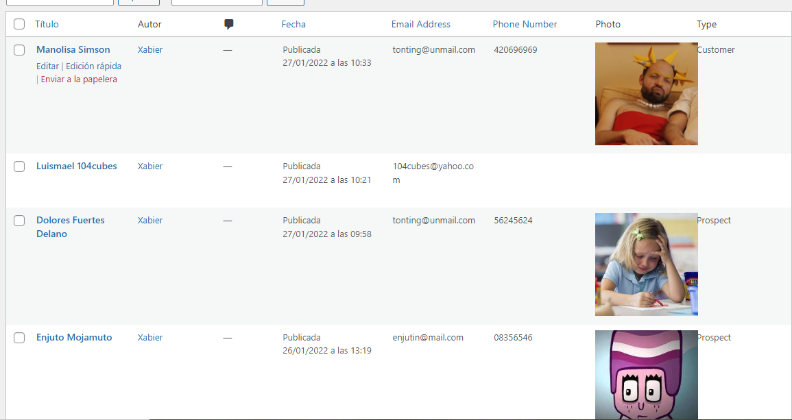
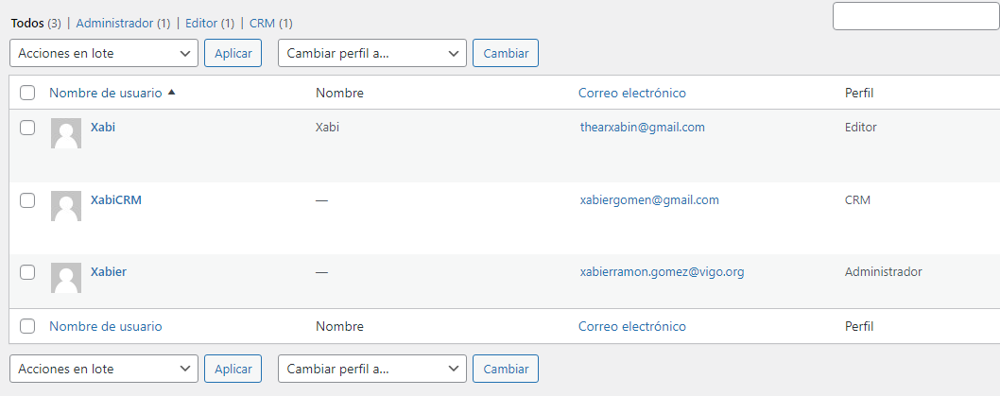

# WP-CRM

 Exercicio de Wordpress do 27 de xaneiro consistente na elaboración dun plugin de Wordpress que engada unha sección de contactos editable, con columnas visibles e ordenables.

### Proceso

Creamos manualmente un directorio na sección de plugins e metemos o código directamente para facer un plugin propio. Dentro del definimos unha función que crea o apartado Contacts na barra de administración e permita a creación de entradas novas (que chamaríamos contactos). Logo, facemos outra función para mostrar as columnas cos datos introducidos dentro e facemos unha array cos datos que nos interesa ter.



Máis tarde, nos baixamos o plugin Advanced Custom Fields e o probamos para poder engadir campos novos a nosa páxina de contactos, como fotos, correo e teléfono móvil. Estes campos saen nas nosas columnas ao engadilos ao array. Logo, borramos a carpeta e a metemos dentro do plugin incluíndoa dentro das suas funcions

```
include_once( 'advanced-custom-fields/acf.php' );
define( 'ACF_LITE', true );
```

Agora o plugin ten as mesmas funcions que Advance Custom Fields.

Por último, administramos qué usuarios de Wordpress teñen acceso as funcionalidades deste plugin. Creamos 2 usuarios novos, un de editor e outro de CRM con distintos niveis de privilexios. Algúns poden ver a sección de Contacts e editala e outros non teñen privilexios. CRM, por exemplo, sí ten.



### Dificultades

A maior complicación foi traballar nun só arquivo, xa que as funcións de PHP son algo complexas e ordear todo o código e non meter bloques onde non deberían é crucial, xa que si non Wordpress deixa de funcionar.
